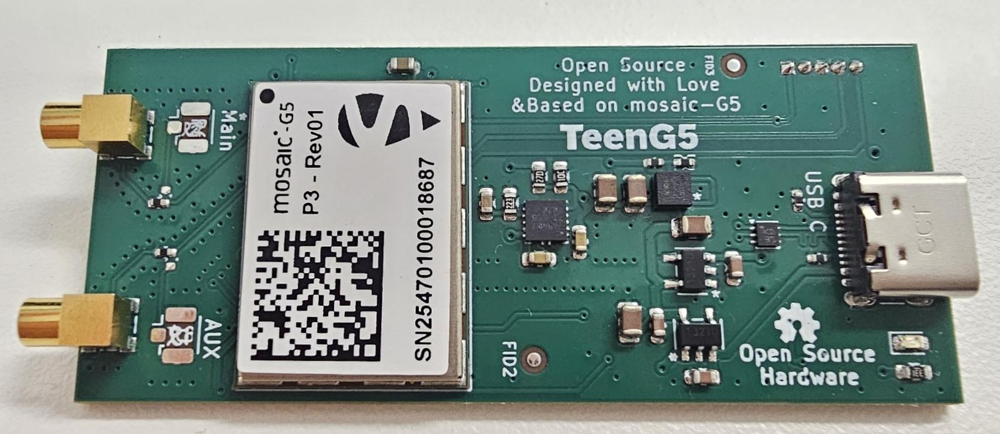

# TeenG5

|TeenG5| Carrier board for Teensy 4.1|
|------|-------|
|Author|  [laekaz](https://github.com/laekaz)|
|Maintainer| [Septentrio gnss github user](githubuser@septentrio.com)|
|external website| https://github.com/septentrio-gnss/TeenG5  |
|License| [CC BY-SA 4.0](https://creativecommons.org/licenses/by-sa/4.0/) and [open source](https://www.oshwa.org/definition/) |

## Table of Content

* [What is TeenG5](#what-is-teeng5)
    * [What is the Teensy 4.1?](#what-is-the-teensy-41)
    * [What is a Carrier Board for Teensy 4.1?](#what-is-a-carrier-board-for-teensy-41)
    * [Produce Yourself?](#produce-yourself)
            * [Do I Need to Source Special Components for Producing This Board?](#do-i-need-to-source-special-components-for-producing-this-board)
    * [What is a mosaic-G5 Module?](#what-is-a-mosaic-g5-module)
        * [Other mosaic-G5 Versions](#other-mosaic-g5-versions)
    * [Who is Septentrio?](#who-is-septentrio)
    * [Deliverables](#deliverables)
    * [Is the Project Open-Source?](#is-the-project-open-source)
* [Disclaimer](#disclaimer)
* [Documentation Sections](#documentation-sections)

## What is TeenG5
This is a compact carrier board that brings high precision GNSS (GPS) which integrates mosaic-G5 Septentrio's GNSS module with basic communications, allowing the system to receive signals from multiple GNSS constellations, such as GPS, Galileo, GLONASS, and BeiDo. The goal of the design is to simplify hardware prototyping and integration of the mosaic-G5 by taking advantage of the Teensy 4.1's high-performance microcontroller, extensive peripheral interfaces, and Arduino-compatible development ecosystem. This makes TeenG5 well suited for embedded applications such as robotics, autonomous vehicles, UAVs, precision agriculture, surveying, timing, and other systems that require low-latency GNSS processing without relying on an external computer.
 
The board can also operate as a standalone device when powered through its USB connector.

### What is the Teensy 4.1?
The Teensy 4.1 is a compact, high-performance microcontroller development board based on the NXP i.MX RT1062 ARM Cortex-M7 processor running at 600 MHz. It offers 1 MB of RAM, 8 MB of onboard flash memory, a microSD card slot, USB host and device capabilities, Ethernet, and a wide range of digital, analog, and communication interfaces (UART, SPI, I²C, and CAN). Compatible with the Arduino IDE through Teensyduino software, it is well suited for robotics, real-time control,embedded systems, audio processing, data acquisition, and other performance-critical applications.

### What is a carrier board for Teensy 4.1?
A carrier board is a board that hosts a removable Teensy 4.1. The Teensy plugs into the board through two 24-pin headers and can be removed or replaced, while the carrier board integrates the Septentrio mosaic-G5 GNSS receiver, power management, and communication interfaces into a single embedded platform.

### Produce yourself?
You can use the design files, Bill of Materials from this project and contact your manufacturing company for production. In this project we used [JLCPCB](https://jlcpcb.com/) for producing the PCB and assembling it. We used JLCPCB because of its competitive pricing and component availability.

##### Do I need to source special components for producing this board?

Yes, Some components are not available through JLCPCB's standard parts library and must be supplied separately. however, if you are assembling the PCB by yourself, all components are available on DigiKey and clearly listed in the project's Bill of Materials. The mosaic GNSS module can be obtained from Digikey or directly from Septentrio. For larger production volumes, we recommend contacting the Septentrio sales team directly at [Septentrio Contact Page](https://www.septentrio.com/en/contact/ask-question)

### What is a mosaic-G5 module?
The mosaic-G5 is a compact GNSS receiver from Septentrio, engineered for high reliability and precise positioning. It integrates the latest multi-band, multi-constellation GNSS technology, providing accurate positions while minimizing power consumption. The receiver can access signals from all major GNSS constellations, including GPS, Galileo, GLONASS, and BeiDou.

#### Other mosaic-G5 versions
Different versions of the mosaic-G5 are available to suit various applications, as summarized below:

| Features     | [mosaic-G5 P1](https://www.septentrio.com/en/products/gnss-receivers/gnss-receiver-modules/mosaic-g5-p1) | [mosaic-G5 P3](https://www.septentrio.com/en/products/gnss-receivers/gnss-receiver-modules/mosaic-G5-P3) | [mosaic-G5 P3H](https://www.septentrio.com/en/products/gnss-receivers/gnss-receiver-modules/mosaic-G5-P3H) |[mosaic-G5 P6](https://www.septentrio.com/en/products/gnss-receivers/gnss-receiver-modules/mosaic-G5-P6) | [mosaic-G5 P8](https://www.septentrio.com/en/products/gnss-receivers/gnss-receiver-modules/mosaic-g5-p8) |
|--------------|--------------|--------------|---------------|---------------|---------------|
| Functionality|High-precision positioning   |High-precision positioning |Positioning + Heading|Positioning + Heading | Positioning + Heading|
| Use case     |Robotics (e.g robotic mowers), GIS devices |UAV, Commercial mowers, Industrial Robotics, Survey, Marine navigation | Marine navigation, Machine control, Autonomous vehicles,  Survey | Autonomous vehicles, Marine navigation, Machine control, Survey | High-end autonomous systems, Robotics, Marine navigation, Survey, Machine control |          
| GNSS bands   | Triple-band  | Quad-band    | Quad-band     |Quad-band |Quad-band  |
| RTK support  | Yes          | Yes          | Yes           |Yes       |Yes        |
| Dual antenna |    No        |  No          | Yes           |Yes       |Yes        |
| Heading      |     NO       |   No         | Yes           |Yes       |Yes        |

### Who is Septentrio?

Septentrio is a leading company that designs, manufactures and sells high precision and multi-frequency GPS/GNSS receivers for demanding applications. Septentrio products are used in different industries including automotive, marine, construction, rail, machine control, logistics, precision agriculture, geographic information systems (GIS), Unmanned aerial vehicles (UAVs), surveying, mapping and scientific development. Septentrio’s receivers constantly deliver accurate and precise GNSS positioning scalable to centimetre-level and designed to perform perfectly in challenging environments. 

Septentrio's technology offers high accuracy and reliability thanks to advanced GNSS signal-processing algorithms as well as [Advanced interference Monitoring and Mitigation (AIM+)](https://www.septentrio.com/en/learn-more/advanced-positioning-technology/aim-anti-jamming-protection) This protects your application against jamming (RF interference) and spoofing (malicious attacks).

For more information about Septentrio products go to [**https://www.septentrio.com/**](https://web.septentrio.com/GH-SSN-home).

### Deliverables
This project provides the following deliverables for system integrators and hardware designers developing solutions based on Septentrio's mosaic-G5 modules.

|Files         |Description   |
|--------------|--------------|
|  [G5_Teensy.kicad_pro](./Kicad/TeenG5/G5_Teensy.kicad_pro)   |KiCad project |
| [G5_Teensy.kicad_pcb](./Kicad/TeenG5/G5_Teensy.kicad_pcb) | KiCad layout |
|  [G5_Teensy.kicad_sch](./Kicad/TeenG5/G5_Teensy.kicad_sch)  |KiCad schematic |
| [TeenG5 3D.step](./Kicad/TeenG5%203D/teenG5%203D.step)   | TeenG5 3D|
| [mosaic-G5.STEP](./Kicad/mosaci-G5/mosaic-G5.STEP)  |mosaic-G5 3D |
| [LGA54_MOSAIC-MINI_SEP.kicad_mod](./Kicad/mosaci-G5/LGA54_MOSAIC-MINI_SEP.kicad_mod)  |mosaic-G5 footprint |
|  [BOM](./Kicad/BOM.xlsx) | TeenG5 Bill of Materials |
### Is the project open-source?
Yes, We made this open source so you can tinker, adapt, and create. If you are building your own robotics project, a spin-off device, or integrating GNSS into a larger system, this is a great starting point.

Open source here means:
* All files fully editable
* Freedom to modify, remix, and innovate
* You can sell your version. No -NC limitations
* May require attribution
* Build on our work, push it further, and even make money doing it

More info about licensing can be found here: [CC BY-SA 4.0](https://creativecommons.org/licenses/by-sa/4.0/) and [open source](https://www.oshwa.org/definition/)

## Disclaimer
This project is **offered as-is**. The main interfaces have been tested, but the design has not been fully checked or approved by the author or Septentrio. You are responsible for how you use it in your own projects. For guidance on working with Septentrio’s GNSS mosaic-G5 modules, we suggest reaching out to Septentrio directly.

Support website: https://www.septentrio.com/en/support
## Documentation Sections

This project provides two main documentation sections:

- **[TeenG5 User Documentation](./TeenG5%20User%20Documentation.md)**  
  Contains information for users on how to install, configure, and use the TeenG5.

- **[TeenG5 Design Documentation](./TeenG5%20Design%20Documentation.md)**  
  Intended for hardware designers who want to understand, customize, or modify the reference design of the TeenG5.
