# TeenG5 Design Documentation

This section describes the design principles and architecture of the Teensy 4.1 in depth.

## Table of Content

* [Design Overview](#design-overview)
* [mosaic-G5 Pinout](#mosaic-g5-pinout)
* [Power Sources](#power-sources)
* [Antennas](#antennas)
    * [Antenna Connectors](#antenna-connectors)
    * [First Antenna](#first-antenna)
    * [Second Antenna](#second-antenna)
* [Teensy 4.1 Serial](#teensy-41-serial)
* [Reset Input](#reset-input)
* [USB-C](#usb-c)
* [LEDs, Events and PPSO](#leds-events-and-ppso)
* [Clock Frequency Reference](#clock-frequency-reference)
* [Further Improvements](#further-improvements)

## Design Overview

The TeenG5 is a four-layer Printed Circuit Board (PCB) designed to mount directly a Teensy 4.1 onto it. The top and bottom layers are used for both signal and power routing. The first internal layer serves as a ground (GND) plane, while the first internal layer is primarily used as a 3.3 V power plane, with limited routing for additional connections where required.

The design as components on the **Top** and **bottom** side of the PCB board. The design uses Surface-Mount Devices (SMDs). throughout, except for the external connector.

The TeenG5 was designed using [KiCad](https://www.kicad.org/download/), an open-source Electronic Design Automation (EDA) suite. In addition to its schematic capture and PCB layout capabilities, KiCad includes an integrated 3D viewer that provides a realistic representation of the assembled board.

The schematic diagram is shown below. For improved readability and access to complete design details, refer to the PDF version of the [schematic]().

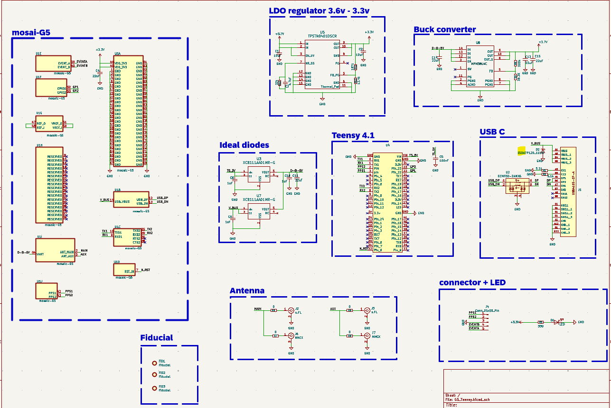

The board layout without the copper pour.

The board layout with the copper pour

            

Layout layer descriptions:

|Layer|Description|
|--------|----------|
|Layer 1| Red traces, copper pour connected to GND |
|Layer 2| Green traces, copper pour connected to 3.3 V|
|Layer 3| Solid GND plane  |
|Layer 4| Blue traces, copper pour connected to GND|

A bottom and top 3D view of the TeeenG5, featuring electronic components.

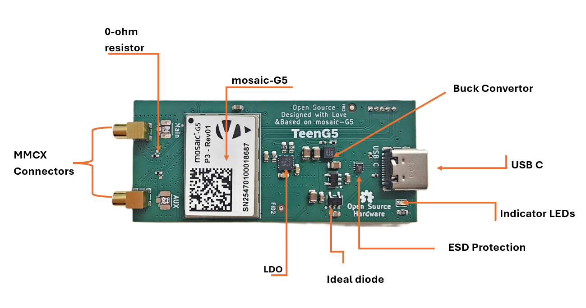
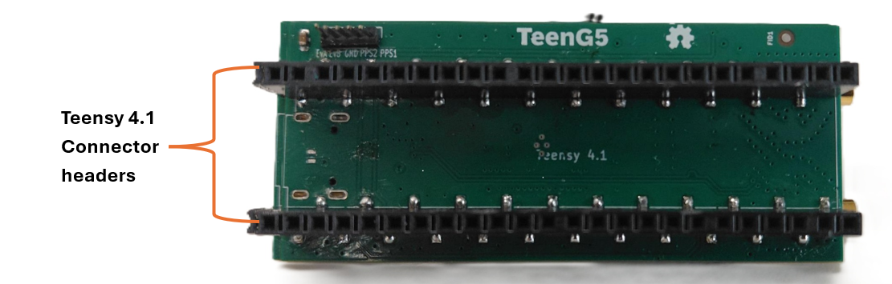

## mosaic-G5 Pinout
The Septentrio mosaic-G5 is the core of the mosaicG5 HAT board. It is a 22.8 x 16.4 mm compact GNSS module of 94 pins with a weight of 2.2 g. Complete information on mosaic-G5 connections can be found in the [Hardware Manual](https://www.septentrio.com/en/products/gnss-receivers/gnss-receiver-modules/mosaic-G5-P3H).

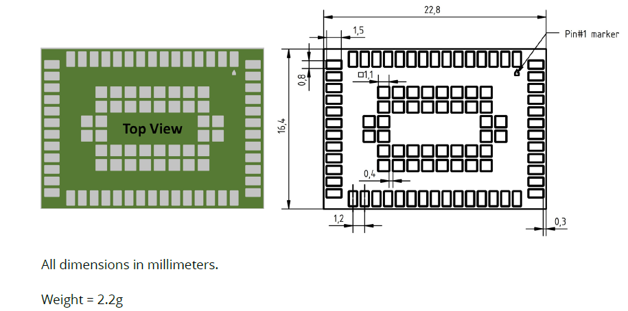

The symbol, footprint and 3D model of mosaic-G5 can be found [here](https://app.ultralibrarian.com/details/536b89de-4b22-11f0-b69d-024899f9dfe1/Septentrio/MOSAIC-G5-P3)

## power sources

The TeenG5 has 2 ways for powering the board; Teensy 4.1 VCC pin and USB-C. The mosaic-G5 module itself runs on 3.3V, thus a buck converter(MPM3814C) is used to regulate the voltage from 5V to 3.7V and an LDO voltage regulator is used to filter the switching noise from the buck converter and to regulate the voltage from 3.7 to 3.3volts(TPS7A9401DSCR). Teensy 4.1 VCC pin and USB-C already provide 5V.

 
 **WARNING:** Applying voltages higher than 5 V to the **VANT** may damage the module

The ideal diodes (**XC8111AA01MR-G**) are used to ensure one-way current flow. Decoupling capacitors (1 µF) are used according to the datasheet. The following figure shows the power section of the schematic.

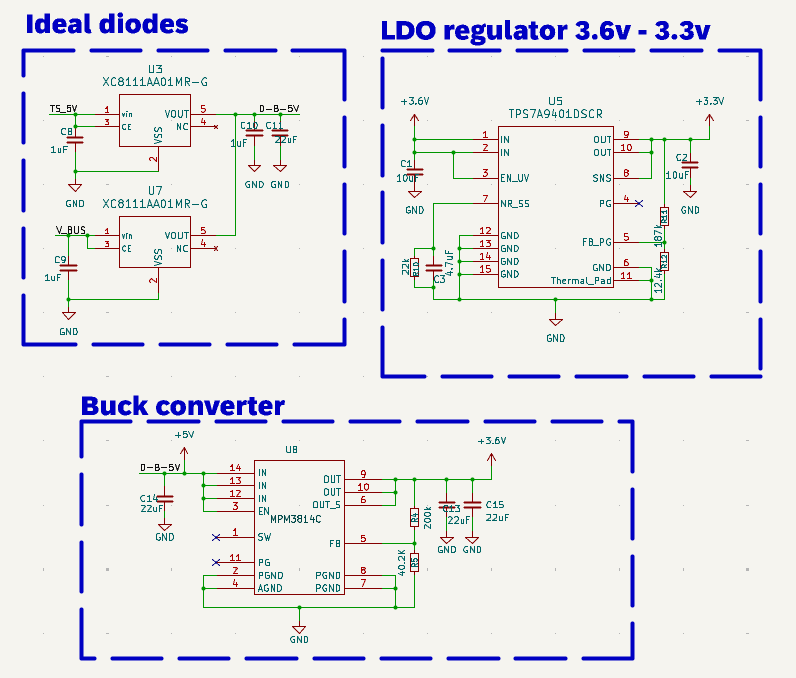

In the figure above:
1. Buck converter(MPM3814C).
2. Voltage regulator (TPS7A9401DSCR).
3. Teensy 4.1 power source (5V pins).
4. Micro USB power source.

## Antennas 
The mosaic-G5 P3H is a dual-antenna while the mosaic-G5 P3 is a single-antenna both of these modules are compatible with the PCB board however, when connecting the mosaic-G5 P3 you only connect the main antenna connector and leave the auxiliary unconnected. Both the antenna pins are not ESD-protected or biased in the schematics because all is done inside the module. 

The following figure shows the antenna section of the schematic.

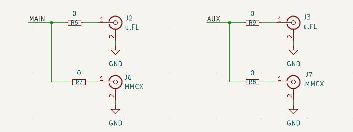

### Antenna Connectors

### First Antenna

The first U.FL antenna J2 is directly connected to a 0 ohm resistor and the first MMCX antenna J6 is also connected to a 0 ohm resistor and they are both connected to the main mosaic-G5 pin.
The DC voltage of the main antenna connection is supplied from the mosaic-G5's VANT pin.

The input impedance of the RF line is 50 Ohms. Thus, antenna trace should have a characteristic impedance (Zo) of 50 Ohms. To determine the proper impedance for the antenna traces for RF signal routing, calculations were performed with the [JLCPCB Impedance Calculator](https://jlcpcb.com/pcb-impedance-calculator)(recommended if you are using JLCPCB as manufacturer) or can use freeware [Saturn PCB toolkit](https://saturnpcb.com/pcb_toolkit). The trace parameters used in the calculation were based on the specifications of the selected PCB manufacturer. Calculations determined that a trace width of 0.1725 mm would provide an impedance of 50Ω to the RF antenna traces.

Having right characteristic impedance ensures reduced signal reflections in the opposite direction thus higher quality of signals. For uniform lines, characteristic impedance is dependent on trace length.

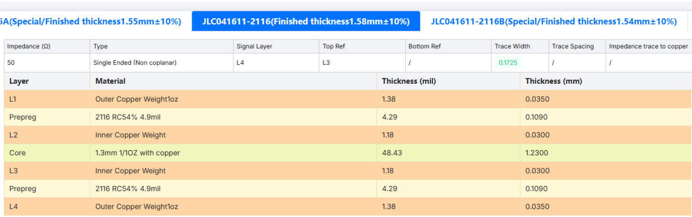

It is also important to stitch vias every few millimeters around the RF line for good ground coherence. Ground stitching vias help to protect line from interference.

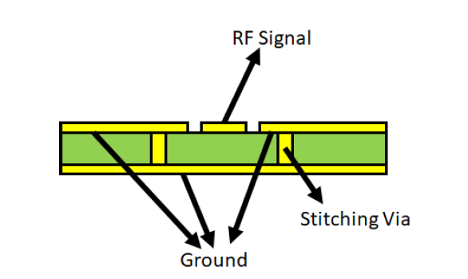

For more details on antennas and interference please refer to mosaic-G5's [Hardware Manual](https://www.septentrio.com/en/products/gnss-receivers?f%5B0%5D=type%3A604).

### second antenna

The second antenna is similar to the first antenna except when using a single antenna module like the mosaic-G5 P3, you do not need to assemble the the second antenna connector. 

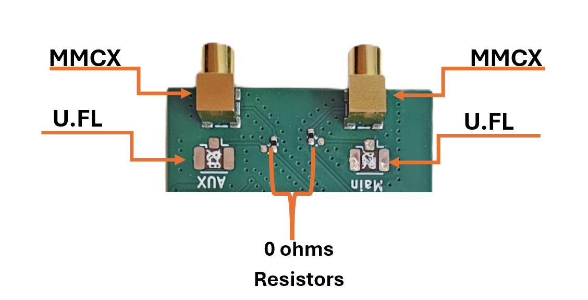

## Teensy 4.1 serial

Serial communication between the mosaic-G5 and the Teensy 4.1 is implemented by connecting UART1 and UART2 connections of mosaic-G5 to Teensy 4.1 UART pins: TX (Pin 0, Pin 1) and RX (Pin 7, Pin 8). The mosaic-G5's TX is connected to the Teensy 4.1's RX while RX is connected to Teensy 4.1's TX for both UARTs.

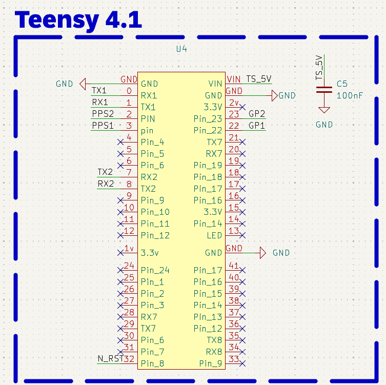

## Reset Input
The nRST_IN pin of mosaic-G5 is directly connected to Teensy 4.1 (Pin 32 in physical header). Refer to [Reset mosaic](#reset-mosaic-G5) in user documentation for more details.

## USB-C
To use mosaic-G5 as a USB device, the following pins of the module should be connected to a USB-C connector:

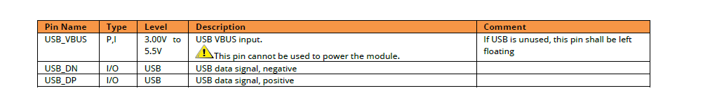

A common mode filter with ESD protection for USB 2.0 (ECMF02-2AMX6) is used with USB_DP (D+) and USB_DN (D-) for protection. The filter suppresses electromagnetic interference (EMI) on high-speed differential USB lines.

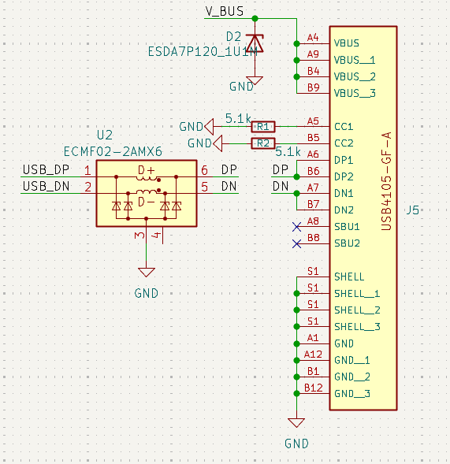

As USB uses a differential pair for data transmission, differential pair impedance (Zdifferential) should be tuned to avoid reflections. Zdifferential needs to be around 90 Ohms. The same [JLCPCB impedance calculator](https://jlcpcb.com/pcb-impedance-calculator) was used to determine the dimensions of the differential signal pair that will carry the USB signals. 

The parameters used for this calculation were the same as those used for the RF antenna traces: the materials, thickness of copper finish, and number of layers of the PCB manufacturer that was selected. The results of this calculation determined that a width of 0.1707 mm would provide the necessary impedance of 90 Ω to the differential signal pair. 

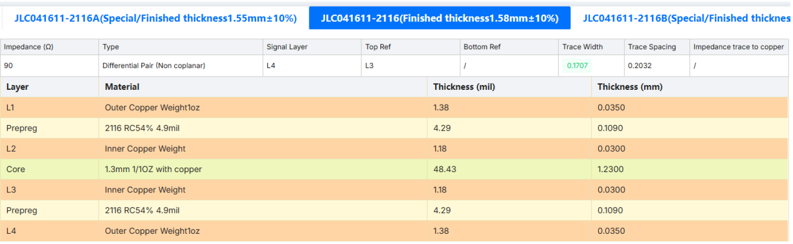

The following figure hights USB parts highlighted. GND vias were stitched around the USB connector and lines to ensure good ground coherence.

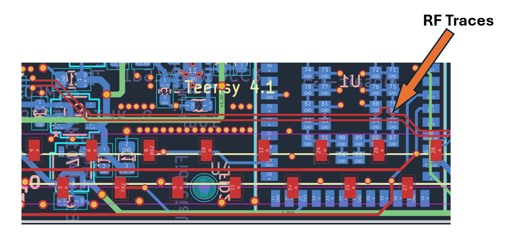

* USB-C connector (USB4105-GF-A).
* Common mode filter.
* USB D+/D- lines.
* VBUS.

## LEDs,Events and PPSO

TeenG5 has 1 LED which is a power indicator.

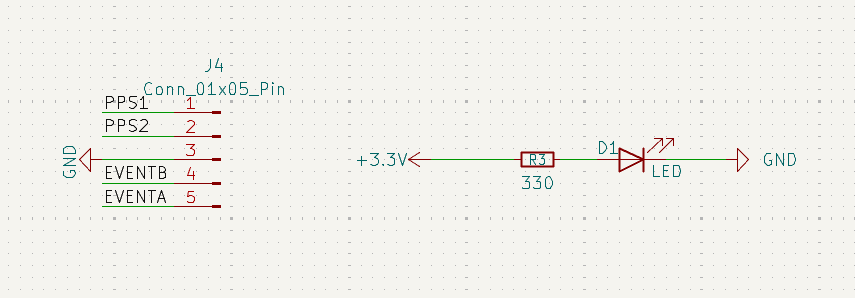

## Clock Frequency Reference
mosaic-G5 module embeds an internal Temperature Compensated Crystal Oscillator (TCXO) for frequency reference. The module can either use its internal TCXO frequency reference or an external frequency reference. In mosaicG5 HAT's case, internal reference is used.

Following are Hardware Manual instructions for using internal TCXO.

Layout connections for REF and VREF_I.

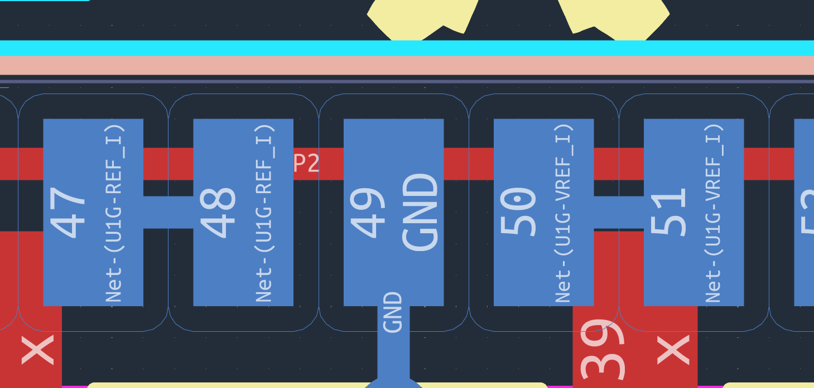

## Further improvements