# TeenG5 user documentation
## Table of Content
* [TeenG5 Manufacturing and Assembly](#teeng5-manufacturing-and-assembly)
    * [Elements to Provide When Manufacturing the Board](#elements-to-provide-when-manufacturing-the-board)
    * [Ordering mosaic Module](#ordering-mosaic-module)
* [General Interfaces of TeenG5](#general-interfaces-of-teeng5)
* [Connecting to Teensy 4.1](#connecting-to-teensy-41)
    * [Preparing Teensy 4.1](#preparing-teensy-41)
    * [Arduino Example](#arduino-example)
    * [GNSS Antenna](#gnss-antenna)
        * [Single/Dual Antenna Mode](#singledual-antenna-mode)
        * [Heading](#heading)
    * [USB Communication](#usb-communication)
    * [Serial Communication](#serial-communication)
    * [Reset mosaic-G5](#reset-mosaic-g5)
    * [PPS Output](#pps-output)
    * [Events](#events)

## TeenG5 Manufacturing and Assembly

This project includes all the files required to manufacture the TeenG5, including the reference design, PCB layout, and Bill of Materials (BOM). You can use these files with your preferred PCB manufacturer. For this project, we used [JLCPCB](https://jlcpcb.com/) for both PCB fabrication and assembly due to their competitive pricing and fast production times.

### Elements to provide when manufacturing the board
When you manufacture your board they will ask you for the following parts:

For the PCB only:
* The PCB design, you will need to export gerber and drill files 

For assembly:
* Bill of Materials (BOM), the list of components used in the project with their reference designators. For this project check [BOM](/Kicad/BOM.xlsx).
* Component Placement List (CPL), this file contains the exact position of each component on the board (X,Y and rotation). CPL is exported from KiCad however, you need to check with the manufacturer services to ensure the right placement for components.

### Ordering mosaic module
You can order the mosaic-G5 from Digi-Key, or you can contact Septentrio at www.septentrio.com for purchasing inquiries or other mosaic models.

| mosaic-G5 versions | Septentrio | Digi-Key part_number|
|-----------------|------------|--------|
| mosaic-G5 P1 |[Septentrio_G5-P1](https://www.septentrio.com/en/products/gnss-receivers/gnss-receiver-modules/mosaic-g5-p1) | - |
| mosaic-G5 P3 | [Septentrio_G5-P3](https://www.septentrio.com/en/products/gnss-receivers/gnss-receiver-modules/mosaic-G5-P3) | [410501](https://www.digikey.com/en/products/detail/septentrio-inc/410501/28527327) |
| mosaic-G5 P3H |[Septentrio_G5-P3H](https://www.septentrio.com/en/products/gnss-receivers/gnss-receiver-modules/mosaic-G5-P3H) | [410502](https://www.digikey.com/en/products/detail/septentrio-inc/410502/28527213) |
| mosaic-G5 P6 |[Septentrio_G5-P6](https://www.septentrio.com/en/products/gnss-receivers/gnss-receiver-modules/mosaic-G5-P6) | - |
| mosaic-G5 P8 |[Septentrio_G5-P8](https://www.septentrio.com/en/products/gnss-receivers/gnss-receiver-modules/mosaic-g5-p8) | - |

## General interfaces of TeenG5
The board exposes the following interfaces:

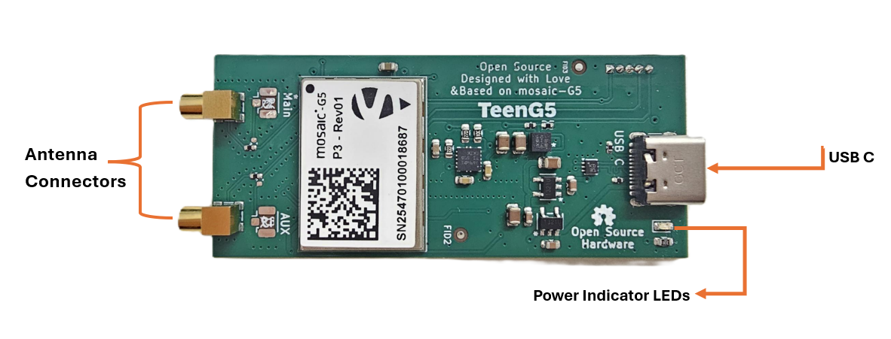

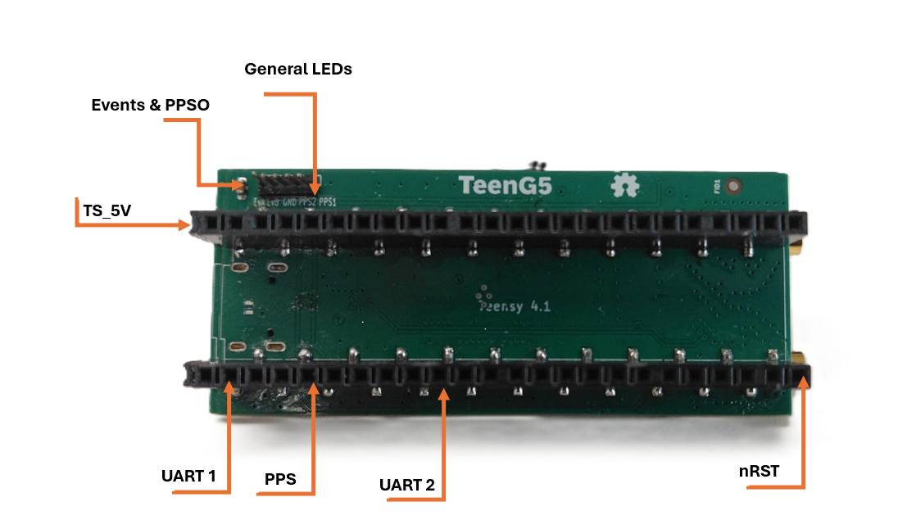


## Connecting to Teensy 4.1
Teensy 4.1 can be easily attached to TeenG5 as shown here:

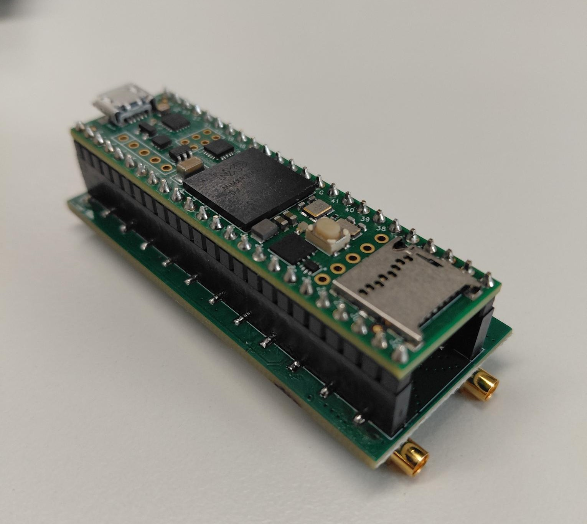

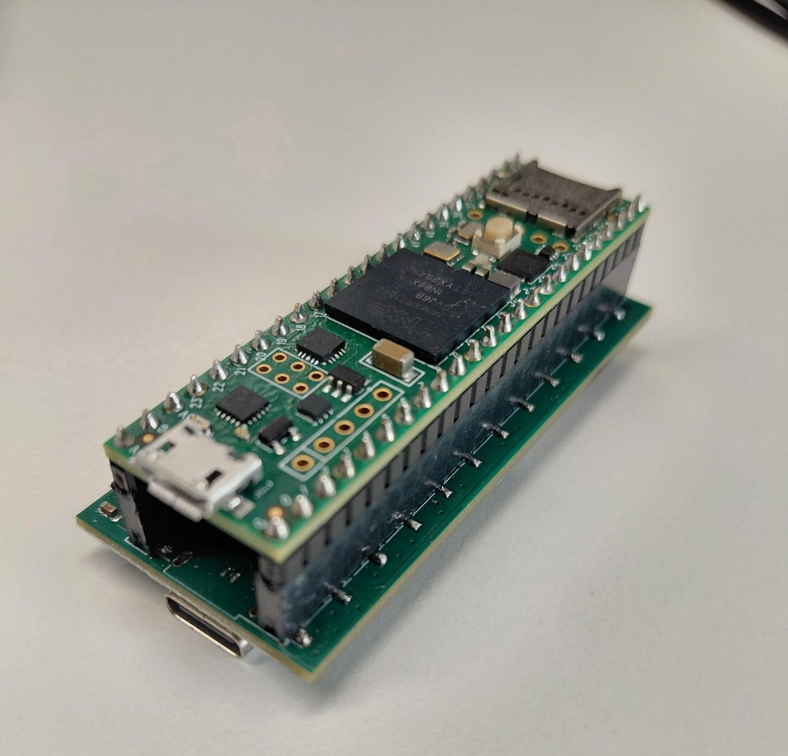

### Preparing Teensy 4.1
Arduino IDE was used to promgram the TeenG5 and Teensy 4.1

To enable communication between TeenG5 and Teensy 4.1, you should make sure required settings configured:

* Pick the correct board,


* pick USB serial,


* and pick the correct serial COM port.

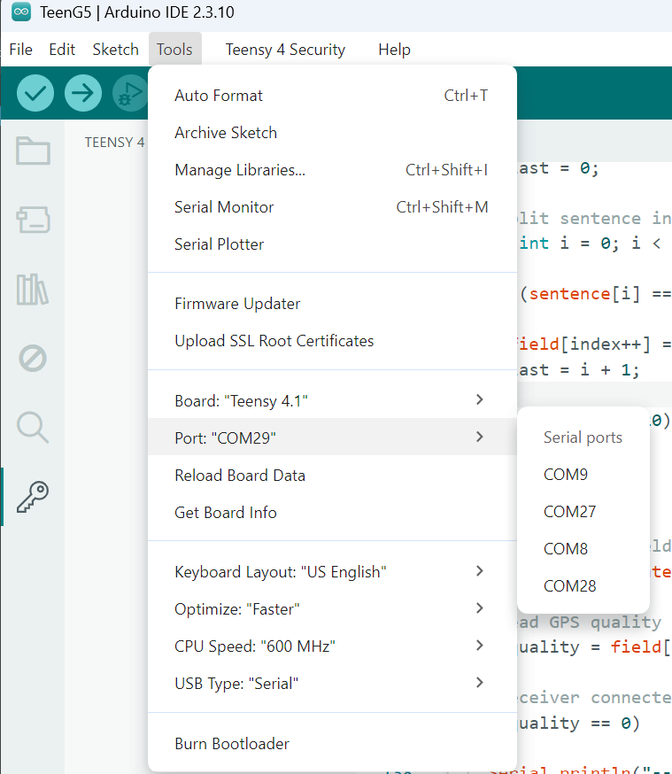

### Arduino Example

```
// Stores one complete NMEA sentence
String nmeaSentence;

// Time when the last character was received
unsigned long lastReceiveTime = 0;

// Keeps track of whether the receiver is currently missing
bool receiverMissing = true;

void setup()
{
  // Start USB serial communication
  Serial.begin(115200);

  // Wait for the Serial Monitor (maximum 5 seconds)
  while (!Serial && millis() < 5000);

  // Start communication with the GNSS receiver
  Serial1.begin(115200);

  // Allow the receiver to boot
  delay(1000);

  // Send several 'S' characters to enter command mode
  Serial1.print("SSSSSSSSSSSSSS\n");
  delay(100);

  // Enable GGA messages every second
  Serial1.print("sno, Stream1, COM1, GGA, sec1\n");
  delay(100);

  Serial.println();
  Serial.println("GNSS Monitor Started");
  Serial.println("--------------------");
}

void loop()
{
  // Read all available serial characters
  while (Serial1.available())
  {
    // Receiver is present
    receiverMissing = false;

    // Remember when the latest data arrived
    lastReceiveTime = millis();

    // Read one character
    char c = Serial1.read();

    // Ignore carriage returns
    if (c == '\r')
      continue;

    // Complete sentence received
    if (c == '\n')
    {
      processGGA(nmeaSentence);

      // Clear buffer for next sentence
      nmeaSentence = "";
    }
    else
    {
      // Build the NMEA sentence
      nmeaSentence += c;
    }
  }

  // No serial data received for more than 3 seconds
  if (millis() - lastReceiveTime > 3000)
  {
    if (!receiverMissing)
    {
      Serial.println("--------------------------------");
      Serial.println("No Receiver Detected");
      Serial.println("--------------------------------");
      Serial.println();

      receiverMissing = true;
    }
  }
}

//----------------------------------------------------
// Process GGA sentence
//----------------------------------------------------
void processGGA(String sentence)
{
  // Ignore sentences that are not GGA
  if (!(sentence.startsWith("$GNGGA") ||
        sentence.startsWith("$GPGGA")))
    return;

  // Array to store the comma-separated fields
  String field[20];

  int index = 0;
  int last = 0;

  // Split sentence into fields
  for (int i = 0; i < sentence.length(); i++)
  {
    if (sentence[i] == ',')
    {
      field[index++] = sentence.substring(last, i);
      last = i + 1;

      if (index >= 20)
        break;
    }
  }

  // Store final field
  field[index] = sentence.substring(last);

  // Read GPS quality indicator
  int quality = field[6].toInt();

  // Receiver connected but no valid position
  if (quality == 0)
  {
    Serial.println("--------------------------------");
    Serial.println("No Position");
    Serial.print("Quality Indicator: ");
    Serial.println(quality);
    Serial.println();

    return;
  } else{

    // Read UTC time
      String utc = field[1];

      // Read latitude (NMEA format)
      float latitude = field[2].toFloat();
      String latDir = field[3];

      // Read longitude (NMEA format)
      float longitude = field[4].toFloat();
      String lonDir = field[5];

      // Read altitude
      float altitude = field[9].toFloat();
      String altitudeUnit = field[10];

      // Display results
      Serial.println("--------------------------------");

      Serial.print("UTC Time: ");
      Serial.println(utc);

      Serial.print("Latitude: ");
      Serial.print(latitude, 4);
      Serial.print(" ");
      Serial.println(latDir);

      Serial.print("Longitude: ");
      Serial.print(longitude, 4);
      Serial.print(" ");
      Serial.println(lonDir);

      Serial.print("Altitude: ");
      Serial.print(altitude);
      Serial.print(" ");
      Serial.println(altitudeUnit);

      Serial.print("Quality Indicator: ");
      Serial.println(quality);

  }

  Serial.println();
}

```

### GNSS Antenna

To take full advantage of the multi-band and multi-constellation capabilities of the TeenG5, it is recommended to use a high-quality multi-band GNSS antenna.

Several manufacturers offer suitable GNSS antennas, including Maxtena and Tallysman. You can also contact Septentrio for guidance on selecting an antenna that best fits your application.

GNSS antennas are available in different form factors and performance levels, each designed for specific use cases such as robotics, precision agriculture, surveying, or industrial machinery. While larger antennas often provide better performance due to improved antenna design and larger ground planes, antenna quality and internal element design are equally important factors. Selecting the right antenna for your application will have a significant impact on positioning accuracy and reliability.

For testing the board we used Tallysman antenna:

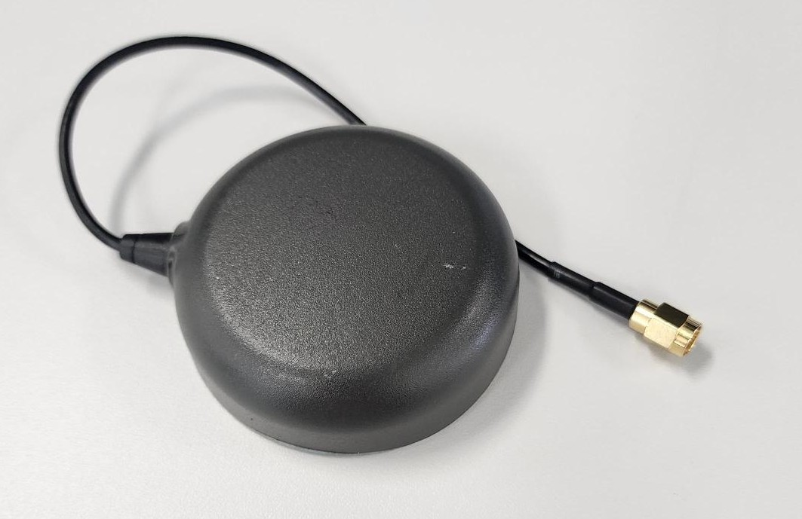

**NOTE**: The VANT (Antenna voltage) pad of mosaic-G5 module is directly connected to the 5 Volts after the ideal diodes so the power is from the Vin of the Teensy 4.1 or VBUS. The internal bias control circuit detects overcurrent
conditions (>150mA) and protects the module in case of short circuit. According to mosaic-G5 hardware manual, VANT accepts **3V** to **5.5V** power supply.


#### Single/Dual Antenna Mode

The receiver can operate in either **single-antenna** or **dual-antenna** mode. Changing the frontend mode only takes effect after a reboot.

* **Single-antenna mode**

Run:

```
setFrontendMode, SingleAnt
```
to configure the receiver for single-antenna mode at the next reboot.

Then save the configuration:

```
exeCopyConfigFile, Current, Boot
```

Finally, reboot the receiver:

```
exeResetReceiver, Hard, none
```

* **Dual-antenna mode**
Run:

```
setFrontendMode, DualAnt
```
to configure the receiver for dual-antenna mode at the next reboot.

Then save the configuration:

```
exeCopyConfigFile, Current, Boot
```
Finally, reboot the receiver:

```
exeResetReceiver, Hard, none
```
P3H, P6 and P8 can run both in single or dual mode deppending on how you configure it. connect both the antenner connectors when using dual mode. 

#### Heading

You can use mosaic-G5 P3H for heading but **it's essential to connect the two antenna connectors.** 

RxTools can be used to monitor the heading.

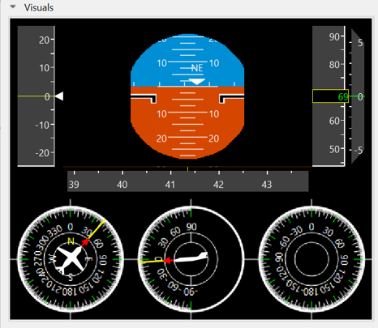

### USB communication

The TeenG5 via USB, provides 2 USB serial ports that can be used with [Septentrio's RxTools](https://www.septentrio.com/en/products/gps-gnss-receiver-software/rxtools?__cf_chl_f_tk=9FZ303SoP8.kFwcI0yDpIdeAKHOC4U8.QrWtEdxvYuM-1783077901-1.0.1.1-mCYy7N0I0ynlIXaYiBgby9w0JgOXAPiThTtNe7ESnbY#resources).

Septentrio's RxTools is a Software which can be used to communicate to the TeenG5 and can be downloaded free of charge from the [Septentrio support site](https://www.septentrio.com/en/products/gps-gnss-receiver-software/rxtools#resources). Once you have downloaded it you can use Septentrio's RxControl and Data Link which can communicate with the receiver over a serial-port connection: select Serial Connection option when opening the connection to the receiver.


**NOTE:** That currently there's no RxTools release for RPi (ARM architecture). Thus, RxTools should be used on a regular PC.

### Serial communication
A simple way to communicate with the mosaic-G5 receiver is to connect one of the UART, it offers 2 UARTs connections.

* Both UART connections are  connected to the Teensy 4.1 for easie integration.


Default COM-Port settings are:
|Parameter     |Value         |
|--------------|--------------|
|baud rate     | 115200     |   
|data bits | 8   |
|parity    |no    |
|stop bits | 1    |
|flow control | none|

Can use comment ```sno, Stream1, COM2, GGA, sec1``` to output GGA data on the UART2

### Reset mosaic-G5

mosaic-G5 could be forced to reset from Teensy 4.1. The N_RST pin of mosaic-G5 is directly connected to Pin 34 in physical header.

The N_RST pin is active negative, which means mosaic will be in RESET mode when N_RST is low (GND). The pin is internally debounced (pull-up) so if pin is left unconnected (floating) the module will not enter RESET mode.

Initially, the Teensy 4.1 GPIO pins are set to INPUT mode. As the Teensy 4.1 input line have high impedance, N_RST will be floating. This means TeenG5 board could run without issues initially even if Pin 34 is not set to HIGH (while kept in input mode). However, it is not recommended to rely on the GPIO initial state. Users should drive HIGH to Pin 34 for the stability of their applications.

To reset module, a LOW pulse, not shorter than 1 microsecond, should be driven to Teensy 4.1.

### PPS output

PPS signals are used for precise timekeeping and time measurement. One increasingly common use is in time synchronization with other sensors (e.g. Lidars or IMUs).

The receiver is able to generate an x-pulse-per-second (xPPS) signal aligned with GPS, Galileo, GLONASS system time, UTC, or with the internal receiver time (RxClock). 

Polarity, frequency and pulse width of PPSO could be configured by **setPPSParameters** command.

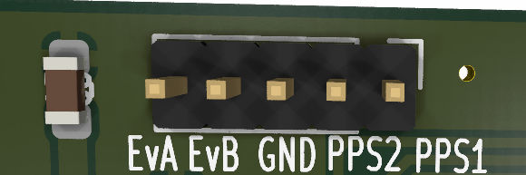

By default, **PPSO2 is disabled**. It can be enabled and configured in **RxControl**:.

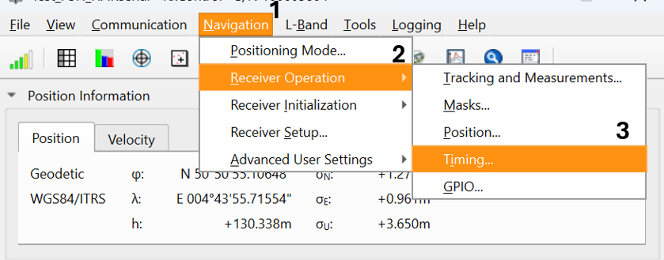

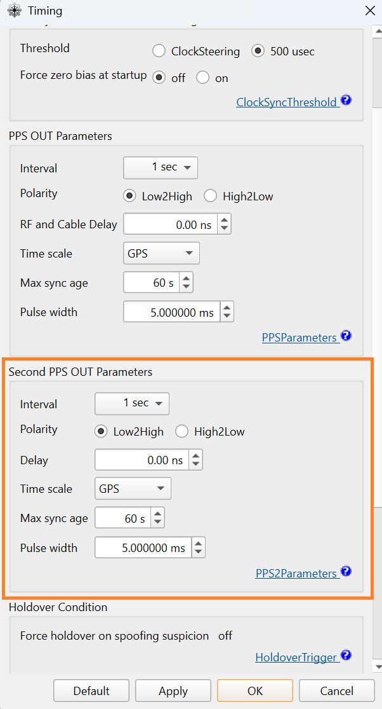


Both PPS Output operate at 3.3 V logic levels. PPSO1 and PPSO2 are directly connected to Teensy 4.1 GPIOs. 

More information on the definition of PPS output or on how to configure the PPS parameters can be found in the mosaic-G5 reference guide. You can download this one from [Septentrio site](https://www.septentrio.com/en/products/gnss-receivers/gnss-receiver-modules/mosaic-G5-P3H).

### Events
EVENTs could be tested directly on TeenG5 board by connecting PPS Output to one of the EVENTs pins. Note that this works with a single wire because they share the same GND. Here PPSO_1 is connected to EVENTB, with PPS interval set to 1 sec.

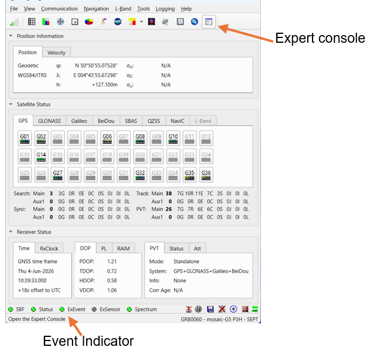
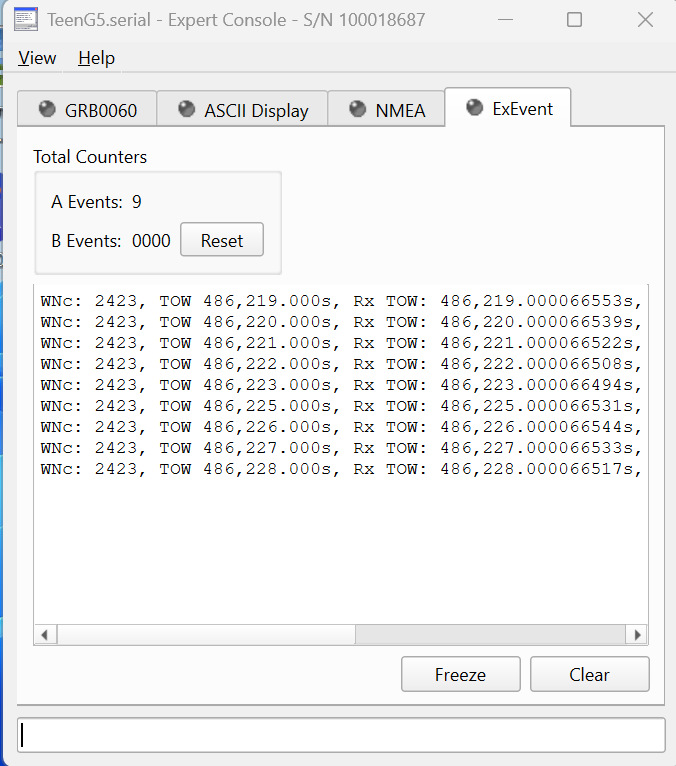

To monitor Events you could use Rxcontrol, clicking on the expert console. Once you have connected an output to the event pin you will see the data being recieved on the pin.

**Note:** The **EVENT** inputs use **3.3 V logic levels**. Applying higher voltages may damage the receiver.

For more information about the EVENT input functionality, see the **mosaic-G5 Reference Guide**, available from the [Septentrio website](https://www.septentrio.com/en/products/gnss-receivers/gnss-receiver-modules/mosaic-G5-P3H).

